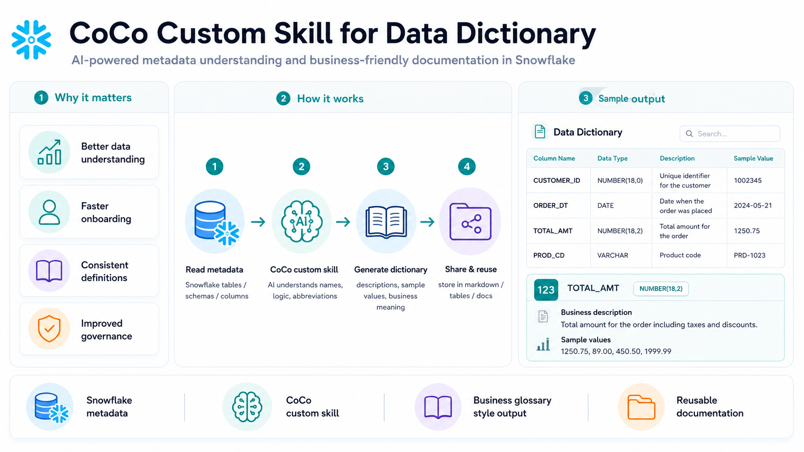

# CoCo Custom Skill for Data Dictionary Creation

An end-to-end Snowflake CoCo custom skill project that generates business-friendly data dictionaries from Snowflake metadata, table structures, column names, transformation logic, and sample values.

The project demonstrates how a reusable CoCo skill can understand technical metadata, decode abbreviations, identify business meaning, capture lineage across Bronze, Silver, and Gold layers, and produce consistent enterprise-style data dictionary documentation.



---

## Use Case

In enterprise data platforms, table and column names are often technical, abbreviated, or difficult for business users to understand.

Data teams usually need to document:

1. What does each table represent?
2. What does each column mean?
3. What business logic created the column?
4. What are the sample values?
5. Is the column technical, business, audit, or derived?
6. How does the column flow across Bronze, Silver, and Gold layers?
7. Can the same documentation format be reused across all tables?

This project solves the problem by creating a reusable Snowflake CoCo custom skill that generates consistent data dictionary documentation for every table.

---

## Project Goal

The goal of this project is to create a reusable CoCo custom skill that can generate high-quality data dictionaries using a standard enterprise format.

The generated data dictionary should include:

- Table overview
- Column-level descriptions
- Business meaning
- Data type
- Sample values
- Source and lineage details
- Transformation logic
- Business rules
- Data quality notes
- Consistent descriptions across all columns
- Business-friendly documentation output

---

## Architecture

```text
Snowflake Dataset
      │
      ▼
Bronze Layer
      │
      ▼
Silver Layer
      │
      ▼
Gold Layer
      │
      ▼
CoCo Custom Skill
      │
      ├── Reads table metadata
      ├── Understands column names
      ├── Interprets abbreviations
      ├── Reviews transformation logic
      ├── Uses sample values
      └── Applies output template
      │
      ▼
Generated Data Dictionary
      │
      ├── Table documentation
      ├── Column descriptions
      ├── Business definitions
      ├── Sample values
      ├── Lineage notes
      └── Reusable markdown files
```

---

## Repository Structure

```text
CoCo_Custom_Skill_Data_Dictionary/
│
├── 00_setup_dataset/
│   ├── .folder
│   ├── 00_infra.sql
│   ├── 01_bronze_layer.sql
│   ├── 02_silver_layer.sql
│   └── 03_gold_layer.sql
│
├── CoCo_instructions/
│   ├── .folder
│   ├── Data_Dictionary_Output_Template.md
│   └── dictionary_generator.md
│
├── data_dictionary/
│   ├── .folder
│   ├── BRONZE_CUSTOMERS_RAW.md
│   ├── BRONZE_ORDERS_RAW.md
│   ├── BRONZE_ORDER_ITEMS_RAW.md
│   ├── CUSTOMER_ORDER_SUMMARY.md
│   ├── DAILY_SALES_SUMMARY.md
│   ├── PRODUCT_SALES_PERFORMANCE.md
│   ├── SILVER_CUSTOMERS.md
│   ├── SILVER_ORDERS.md
│   ├── SILVER_ORDER_ITEMS.md
│   └── retail_db_data_dictionary.md
│
├── docs/
│
└── README.md
```

---

## Setup

### 1. Create Snowflake Infrastructure

Create the required Snowflake database, schemas, warehouse, and base setup objects.

```sql
00_setup_dataset/00_infra.sql
```

---

### 2. Create Bronze Layer

Create and load raw retail source tables.

```sql
00_setup_dataset/01_bronze_layer.sql
```

The Bronze layer represents raw source data such as:

- Customers
- Orders
- Order items

---

### 3. Create Silver Layer

Create cleaned and standardized tables from the Bronze layer.

```sql
00_setup_dataset/02_silver_layer.sql
```

The Silver layer applies basic transformations such as:

- Standardized column names
- Cleaned customer details
- Standardized order fields
- Prepared order item data
- Business-ready intermediate tables

---

### 4. Create Gold Layer

Create analytics-ready Gold layer tables and summary outputs.

```sql
00_setup_dataset/03_gold_layer.sql
```

The Gold layer includes business-friendly outputs such as:

- Customer order summary
- Daily sales summary
- Product sales performance

---

## CoCo Custom Skill Files

### Data Dictionary Output Template

This file defines the standard format that every generated data dictionary should follow.

```text
CoCo_instructions/Data_Dictionary_Output_Template.md
```

The template helps ensure that all output is:

- Consistent
- Business-friendly
- Easy to review
- Easy to reuse
- Suitable for enterprise documentation

---

### Dictionary Generator Skill

This file contains the CoCo custom skill instructions used to generate data dictionaries.

```text
CoCo_instructions/dictionary_generator.md
```

The skill is designed to:

- Inspect Snowflake table metadata
- Understand column naming patterns
- Decode abbreviations
- Review table logic and transformations
- Use sample values for better descriptions
- Generate table-level and column-level documentation
- Follow the standard output template
- Keep descriptions consistent across all tables

---

## Generated Data Dictionary Outputs

The generated data dictionary files are stored in:

```text
data_dictionary/
```

Example output files:

```text
data_dictionary/BRONZE_CUSTOMERS_RAW.md
data_dictionary/BRONZE_ORDERS_RAW.md
data_dictionary/BRONZE_ORDER_ITEMS_RAW.md
data_dictionary/SILVER_CUSTOMERS.md
data_dictionary/SILVER_ORDERS.md
data_dictionary/SILVER_ORDER_ITEMS.md
data_dictionary/CUSTOMER_ORDER_SUMMARY.md
data_dictionary/DAILY_SALES_SUMMARY.md
data_dictionary/PRODUCT_SALES_PERFORMANCE.md
data_dictionary/retail_db_data_dictionary.md
```

These files document the tables across Bronze, Silver, and Gold layers.

---

## What the Skill Generates

For each table, the CoCo skill generates documentation such as:

- Table name
- Table purpose
- Business description
- Source layer
- Target layer
- Column name
- Data type
- Column description
- Business meaning
- Sample values
- Transformation logic
- Source column or source table
- Data quality notes
- Usage notes

---

## Example Questions This Project Answers

```text
What does the ORDER_DT column mean?

What is the difference between raw orders and silver orders?

Which columns are derived in the Gold layer?

What sample values exist for each column?

How was the daily sales summary created?

Which tables are used for product sales performance?

What is the business meaning of each column?
```

---

## Why This Project Matters

A good data dictionary helps data teams and business users understand data faster.

This project helps with:

- Faster onboarding for new users
- Better understanding of tables and columns
- Consistent business definitions
- Reduced manual documentation effort
- Improved data governance
- Better collaboration between business and data teams
- Reusable documentation generation using CoCo custom skills

---

## Snowflake Features Used

- Snowflake tables
- Bronze, Silver, and Gold data layers
- SQL transformations
- Snowflake metadata
- CoCo custom skill instructions
- Markdown-based documentation
- AI-assisted data dictionary generation

---

## Suggested Workflow

```text
1. Run the setup scripts to create the sample retail dataset.
2. Review the Bronze, Silver, and Gold tables.
3. Register or use the CoCo custom skill instructions.
4. Ask CoCo to generate a data dictionary for selected tables.
5. Use the output template to keep documentation consistent.
6. Store generated files in the data_dictionary folder.
7. Review, refine, and reuse the generated documentation.
```

---

## Sample CoCo Prompt

```text
Generate a complete enterprise-style data dictionary for the selected Snowflake table.

Use the provided data dictionary output template.

For each column, include:
- Data type
- Business-friendly description
- Sample values
- Transformation logic
- Source column or source table
- Data quality notes
- Usage notes

Keep descriptions consistent across all columns and explain abbreviations in simple business language.
```

---

## Key Benefits

- AI-powered data dictionary generation
- Reusable CoCo custom skill
- Consistent documentation format
- Business-friendly column descriptions
- Better understanding of abbreviations and transformations
- Supports Bronze, Silver, and Gold architecture
- Reduces manual documentation effort
- Improves data governance and discoverability

---

## Cleanup

If required, remove the Snowflake objects created for the sample dataset after the project is complete.

Before cleanup, confirm that the database, schemas, tables, views, and generated documentation are no longer required.
